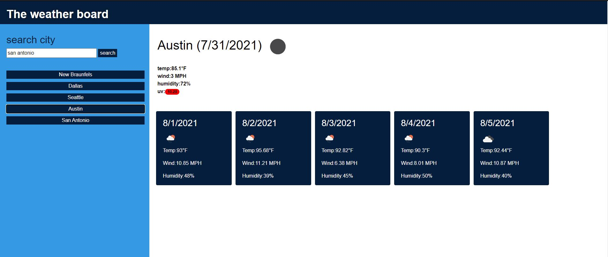

# weather-dashboard-week-6-challenge

for this program I began by creating an array to keep track of the past citys that have been searched. I then created a handler for both the search buttton and city buttons created from past searches. the search button will pull in the city input for the city to be searched for where the city buttons will pull in the text of the button. the next function performs the fetch for the city to be searched for. the next function handles the data from the fetch. If was unsuccessful it will display the alert of the message of the object. if it was successful it creates a date, pulls the city name, tempature, wind speed, humidty, latitude, longitude and weather icon. the function then makes an element and appends it to the weather div it the builds a button for the past city buttons. then I create a new link to be fetched for the five day weather and uv level. The function getFive function takes in the data of the last fetch. It first gets uv and gets the approprate class for its approprate level and appends it to the rest of the weather. I then create an array for five items and have the fuction create and pull out the weather information for the next five days. I also create the dates for the next five days using moments.js. I then make make append it to the card and append the card to the daily div and end the program. the next function is to build the button of past searches. if first sees if the button already exist for that city if it does it ends the function. If not it creates a new button, adds the city name to it, adds the approprate classes, adds the city to cityArr and then appends to citys. the last two things in my javascript attachs the buttons to there handler function.                                                                           

## Lessons Learned
in this lesson, we learned how to use the fetch function to pull data from a server side api and how to use that data within an our website. We also learned how to return a fetch within a fetch to pull in more data, the lesson also reinforced javascript and provided us with more training and hand on experence with the language. This after learning about third-party APIs which more resemble online librarys that enhance a website rather then provide it with data.

## Screenshots

## Documentation

[GitHub Repo](https://github.com/allenharborth9835/weather-dashbourd-week-6-challenge)
[Live Page on Github](https://allenharborth9835.github.io/weather-dashbourd-week-6-challenge/)
